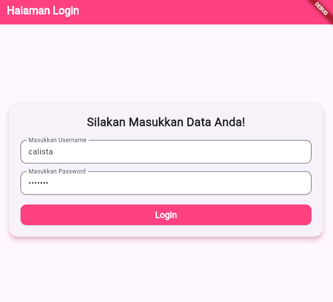
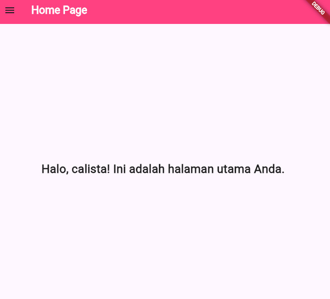
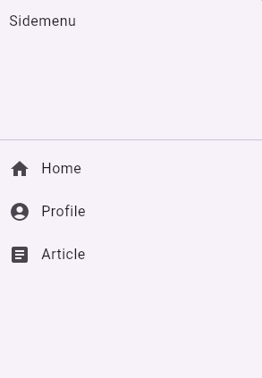
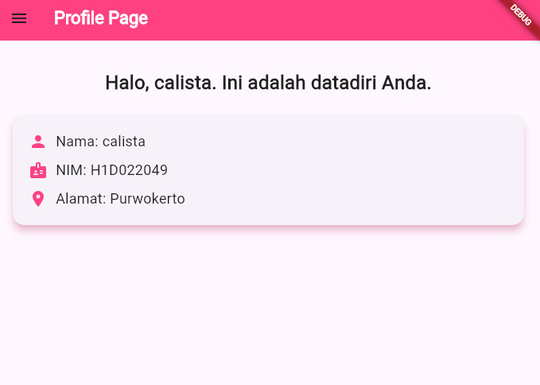

Nama: Calista Anindita
NIM: H1D022049
Shift Baru: C

1. Login Page
    
    a.  Proses input data dengan TextEditingController
        >> _usernameController untuk mendapatkan input username.
        >> _passwordController untuk mendapatkan input password.
    b.  Menyimpan input
        >> Ketika tombol login ditekan maka operasi dari if(_usernameController.text == 'calista' && _passwordController.text == '123aswq') berjalan, yang berarti aplikasi akan mengecek apakah teks yang diinputkan oleh user pada textfield username adalah calista dan pada textfield password 123aswq.
        >> Jika user menginputkan data yang sesuai, data akan disimpan dalam fungsi  _saveUsername dan fungsi _showDialog akan muncul. 
    c. Proses setelah input
        >> Apabila data yang diinputkan oleh user telah sesuai, aplikasi akan menampilkan fungsi _showDialog dengan informasi "Anda Berhasil Login". Setelah itu user akan dialihkan ke halaman homepage menurut kode const HomePage().
        >> Apabila data yang diinputkan oleh user tidak sesuai, aplikasi akan menampilkan fungsi _showDialog dengan informasi "Username dan Password Salah" dan user akan dikembalikan ke halaman login menurut kode const LoginPage().
2. Home Page
    
    a.  Mengambil data username
        >> prefs.getString('username') mengambil data username yang disimpan di memori perangkat saat user login.
    b.  Menampilkan username
        _loadUsername() mengambil username yang disimpan dengan $namauser untuk menampilkan username yang diinputkan.
    c.  Menampilkan sidemenu
        >> drawer: const Sidemenu() untuk menampilkan navigasi tambahan di aplikasi.
3. Sidemeu
    
    a.  Home Page
        >> leading: const Icon(Icons.home), untuk menampilkan icon yang akan digunakan untuk home page.
        >> builder: (context) => const HomePage(), untuk mengalihkan ke halaman home page.
    b.  Profile Page
        >> leading: const Icon(Icons.account_circle), untuk menampilkan icon yang akan digunakan untuk profile page.
        >> builder: (context) => const ProfilPage(), untuk mengalihkan ke halaman profile page.
    c.  Article Page
        >> leading: const Icon(Icons.article), untuk menampilkan icon yang akan digunakan untuk article page.
        >> builder: (context) => const ArticlePage(), untuk mengalihkan ke halaman article page.
4. Profile Page
    
    a.  Menampilkan nama
        >> Menampilkan 'Nama: $namauser', dengan data $namauser yang diambil dari username saat user melakukan login.
    b.  Menampilkan NIM
        >> Menampilkan 'NIM: $nim', dengan data yang diambil dari final String nim = "H1D022049";  
    c.  Menampilkan Alamat
        >> Menampilkan 'Alamat: $alamat', dengan data yang diambil dari final String alamat = "Purwokerto"; 
5. Article Page 
    
